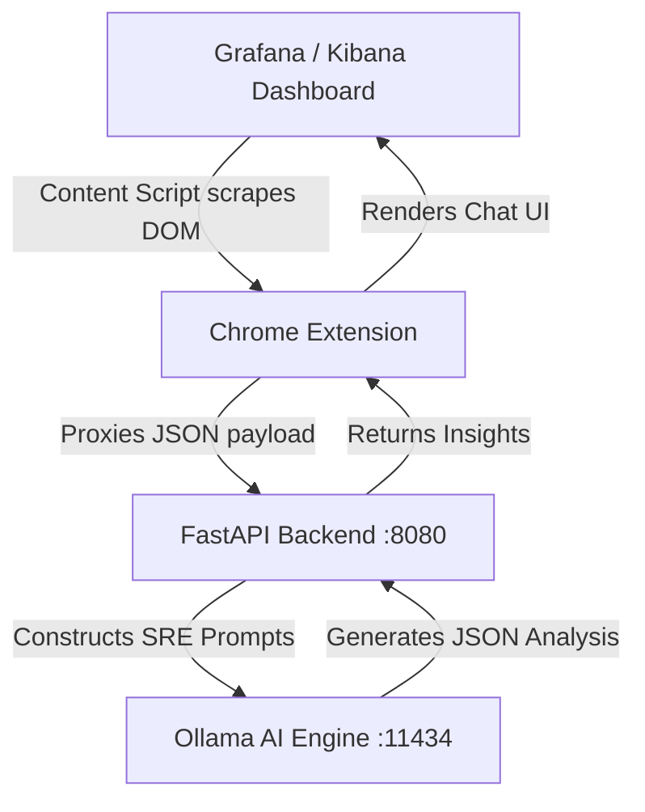

# 🚀 SRE Copilot - AI Observability Assistant

**SRE Copilot** is a zero-config, entirely local AI assistant designed to sit directly inside your observability dashboards. 

It injects a smart chat interface directly into any public **Grafana** or **Kibana** dashboard using a Chrome Extension. With a single click, it securely reads the metrics on your screen, processes them through a completely local AI (`phi3:mini`), and instantly provides root-cause analysis and remediation steps.

---

## ✨ Key Features

- 🔒 **Absolute Privacy (100% Local):** All AI processing happens completely offline in a local Docker container using Microsoft's `phi3:mini` model. Zero metrics, logs, or proprietary data ever leave your laptop.
- 🎯 **Targeted Selection Mode:** Use the "Select Specific Panel" tool to highlight individual charts (e.g., just the CPU or Memory panel) for highly focused AI analysis.
- ⚡ **Zero-Integration Required:** Unlike traditional Grafana/Kibana plugins that require admin access to install on the server, this is a client-side Chrome Extension. It works out-of-the-box on *any* dashboard.

---

## 🏗️ Architecture



### 1. The Frontend (Chrome Extension)
- **Smart DOM Scraper:** Intelligently extracts raw text from the dashboard while automatically filtering out UI noise and boilerplate navigation text.
- **Native Chat UI:** A sleek, non-intrusive chat window injected natively over the dashboard with keep-alive pings to bypass Chrome Service Worker limits.

### 2. The Backend (FastAPI Microservice)
- **Local Proxy:** A lightweight Python/FastAPI server running in Docker (`localhost:8080`). It acts as a secure bridge, validating requests via strict Pydantic schemas.
- **Prompt Engineering Engine:** Normalizes the scraped data and constructs highly structured, strict prompts designed specifically to enforce JSON outputs from small models.

### 3. The AI Engine (Ollama)
- **Model:** Microsoft's **`phi3:mini`** (3.8B parameters).
- **Execution:** Runs 100% locally via Ollama in a Docker container.

---

## 🚀 Quick Start (Local Docker Setup)

### Prerequisites
- Docker & Docker Compose
- Chrome Browser

### 1. Start the Backend Stack
```bash
git clone https://github.com/sajid1947/observability-assistant.git
cd observability-assistant
cp .env.example .env
docker compose up -d
```
*Note: On the first run, the `obs-ollama-pull` container will download the `phi3:mini` model automatically (approx. 2.2GB). This may take a few minutes.*

### 2. Install the Chrome Extension
1. Open Google Chrome and navigate to `chrome://extensions/`
2. Enable **"Developer mode"** in the top right corner.
3. Click **"Load unpacked"** and select the `chrome-extension/` folder from this repository.

### 3. Analyze your Dashboards
1. Navigate to any Grafana or Kibana dashboard.
2. Click the new **✨ AI Assistant** button that appears in the bottom right corner of your screen.
3. Click **"Select Specific Panel"** and click on a chart to get instant root cause analysis!

---

## ⚠️ Current Status
This project is currently an early **Proof of Concept (PoC) / Working Prototype**. It is designed to demonstrate the immense value of using Small Language Models (SLMs) for localized, secure SRE incident response.

Contributions, feature requests, and PRs are highly welcome as we continue to improve the prompt engineering and selection accuracy!

---

## 📜 License
Apache 2.0
